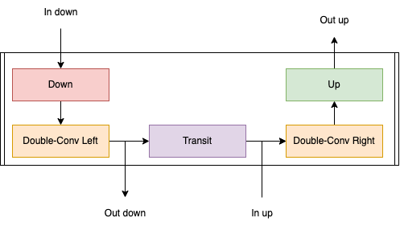

# GeneralUnet

Code companion to section 4.1 (Network Coding) of :

*Meunier. E & Bouthemy P. Unsupervised space-time network for temporally-consistent segmentation of multiple motions (CVPR 2023)*

## Usage

Find examples of usage in : [Notebook Example](Notebooks/Examples Usage.ipynb)

## The Speech

In this work, we explored different ways of dealing with the input optical flow volume and especially different interactions between time steps. We also wanted to use a multi-resolution structure to segment large inputs while keeping accurate boundaries. In order to easily handle these different options, we developed an original and flexible implementation of a U-net based on the decomposition of its structure into five modules as described in Figure.

The skeleton of our network is a version of the classical U-net calling abstract instances of these modules and applying error checks to control their outputs. Using our implementation, one can easily instantiate a novel architecture by solely implementing desired modules without getting involved in the core steps of the U-net. Since all U-net blocks are composed of the same modules, we can stack them making the code needed to implement a new architecture minimal. The input and bottleneck layers of the U-net are handled seamlessly by using a part of provided modules.

This framework makes it straightforward to implement a multidimensional U-net, to incorporate various transformations in the transit layer (e.g., transformer as in [1] or recurrent CNN as in [2]), or to change the sampling or upsampling steps, keeping the same general skeleton between all these different architectures. For example, in our work, we implemented a version of downsampling and upsampling that is applied only on the spatial dimension, while double convolutions are applied on both the spatial and temporal dimensions. The proposed implementation encompasses many of the solutions described in Section (related-work}, and allows new ideas to be tested quickly and in a standardized way. It is also applicable beyond motion segmentation. We will make the code available in an open source repository.

  

Diagram of the prototype layer in our implementation of the U-net. “Double-Conv Left” and “Double-Conv Right” are applying several transformations of the feature maps after downscaling and before upscaling respectively. In classical U-net architecture, it is a 2D convolution kernel applied on the spatial dimension followed with a batch norm. “Down” is a downscaling layer that reduces the spatial dimension of the feature map. In classical U-net architecture, it is implemented using max pooling 2D. “Up” is a block that increases the dimension of the feature map usually implemented with bilinear interpolation or transposed convolution. “Transit” is the connection between the down path and the up path. In classical U-net architecture, it is a skip connection.

[1] : Xie, Junyu, Weidi Xie, and Andrew Zisserman. "Segmenting moving objects via an object-centric layered representation." Advances in Neural Information Processing Systems. 2022.

[2] : S. Shahabeddin Nabavi, M. Rochan, and Y. Wang. Future semantic segmentation with convolutional LSTM. In Bristish Machine Vision Conference, Newcastle upon Tyne, 2018.
